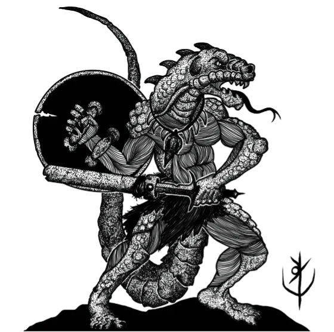

## Что такое Шэдоударк?
Шэдоударк RPG — это фэнтезийная приключенческая игра, где вы и ваши спутники отправляетесь в забытые руины, затерянные города, леса, кишащие пауками, и даже в логова свирепых драконов в поисках золота и славы.

Шэдоударк — это любое место, где правят опасность и тьма. Оно крепко держит в гнилых когтях древние тайны и покрытые пылью сокровища, вызывая искателей удачи испытать свою судьбу.

С вашими спутниками по приключениям вы столкнётесь с зловещими ловушками Шэдоударк, могущественной магией и безжалостными монстрами.

Если вы выживете, то вернётесь с несметными богатствами, вырванными из пасти самой смерти. И очень скоро вы вновь услышите зов Шэдоударк!

## Что определяет эту игру?
Скорость, опасность и простота.
Магия опасна, а сражения — быстры и смертельны. Чтобы выжить, необходимо быть сообразительным.

Шэдоударк RPG — это игра с минималистичными и интуитивно понятными правилами. Она поощряет быстрые решения, а не поиски ответов в толстом своде правил.

В этой игре факел сдерживает наступающую тьму всего на один час реального времени.
Нельзя терять ни секунды, когда пламя вот-вот погаснет...

## Как играть?
Всё, что нужно для начала игры, находится в этом томе.
Перейдите к следующему разделу, чтобы ознакомиться с основами!
